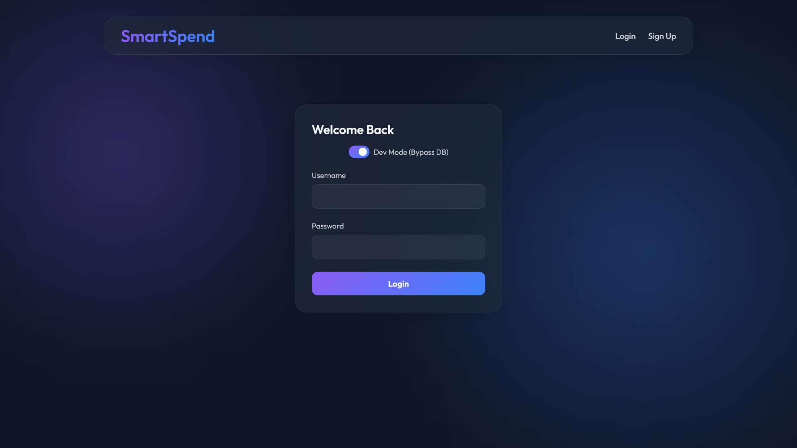
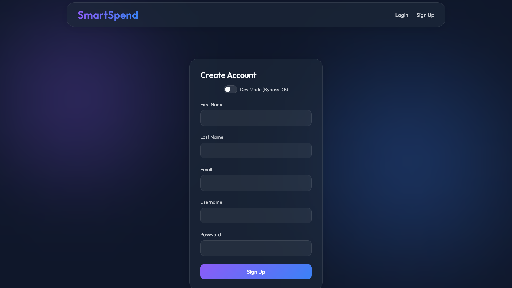
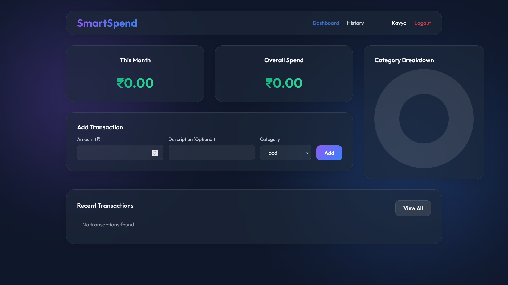
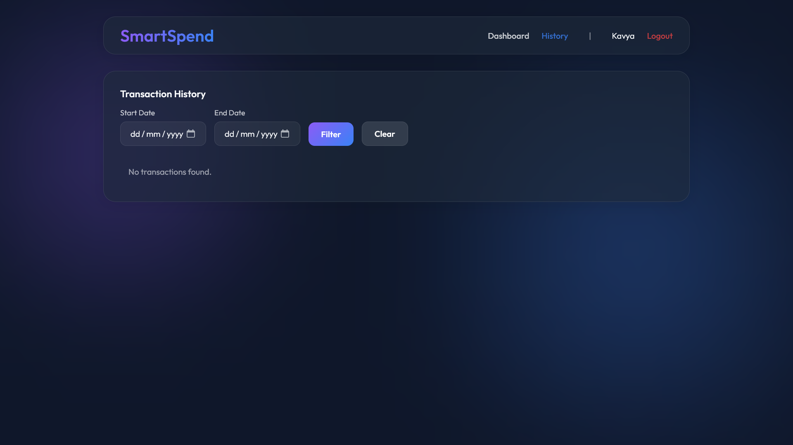
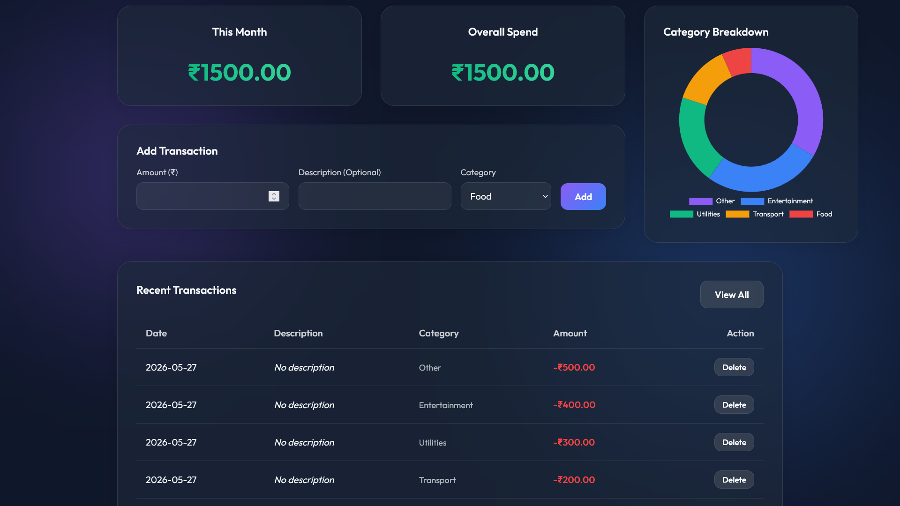
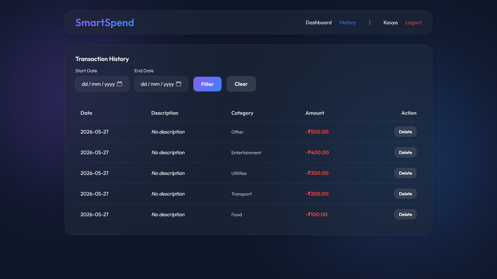

<div align="center">
  
  # ✦ SmartSpend v1.0 ✦
  
  *A minimal, elegant, and secure expense-tracking application.*
  
  <br />

  
  
  
  

</div>

<br />

> [!NOTE]  
> **SmartSpend** was originally developed in 2023, as part of the academic curriculum for the Project Exhibition - I course at **VIT Bhopal University**. It has now been completely transformed into a fully modern web application, shedding its legacy prototype roots!

---

## 🌌 Overview

**SmartSpend v1.0** is a comprehensive expense-tracking application built to provide unparalleled financial visibility. It leaves behind the legacy monolithic structure in favor of a modern, decoupled architecture. Driven by a blazing fast Python REST API backend and a beautifully crafted Vanilla JavaScript Single Page Application (SPA) frontend, it delivers a seamless user experience.

The design philosophy embraces **glassmorphism** and dynamic **gradients** within a rich Dark Mode environment, offering a premium and immersive visual aesthetic that makes managing finances a joy.

---

## 📸 Application Gallery

<div align="center">
  
  
  <br/><br/>
  
  
  <br/><br/>
  
  
</div>

---

## ✨ Core Features

* ⚡ **Decoupled Architecture**: A robust Python/Flask REST API cleanly separated from a lightweight Vite-powered frontend.
* 🎨 **Immersive Dark UI**: Designed with smooth background orbs, frosted glass components (`backdrop-filter: blur`), and clean, responsive data tables.
* 📊 **Visual Insights**: Interactive, animated doughnut charts powered by `Chart.js` that aggregate and visualize category spending in real-time.
* 🕒 **Dynamic Dashboard & History**: Instantly track your most recent expenditures on the dashboard, or navigate to a dedicated History view to filter transactions via custom date-range pickers.
* 🛠️ **Developer Mode**: A seamless toggle switch built right into the login screen that entirely bypasses the database—perfect for UI exploration and rapid local testing.
* 🔒 **Complete Auth System**: End-to-end secure user registration and login, featuring robust session handling.
* 🏛️ **Legacy Preservation**: The original `v0` prototype codebase and academic documents are preserved securely in the `v0Archive/` directory.

---

## 🛠️ Technology Stack

| Layer | Technology | Description |
| :--- | :--- | :--- |
| **Frontend** | HTML5, Vanilla JS, CSS3, Vite | A lightning-fast SPA built without bulky frameworks. |
| **Backend** | Python, Flask, Flask-Cors | A stateless REST API handling all business logic. |
| **Database** | MySQL, PyMySQL | Relational database mapping for users and transactions. |
| **Styling** | Custom Glassmorphism, Google Fonts | Tailored CSS relying on the *Outfit* font family. |
| **Visuals** | Chart.js | Canvas-based rendering for dynamic financial charts. |

---

## 📂 Project Architecture

```text
📦 SmartSpend
 ┣ 📜 schema.sql       # Root MySQL Database Schema
 ┣ 📂 screenshots/     # High-resolution UI showcase images
 ┣ 📂 backend/         # Flask REST API Server
 ┃ ┣ 📜 app.py         # Main API Application & Routing
 ┃ ┣ 📜 config.py      # Environment Configurations
 ┃ ┣ 📜 db.yaml        # Database Credentials (Local)
 ┃ ┗ 📜 requirements.txt
 ┣ 📂 frontend/        # Vite SPA Frontend Environment
 ┃ ┣ 📂 src/
 ┃ ┃ ┣ 📜 main.js      # Core Application Logic, State, and UI
 ┃ ┃ ┗ 📜 style.css    # Global UI Styling and Animations
 ┃ ┣ 📜 index.html     # Application Entry Point
 ┃ ┗ 📜 package.json
 ┗ 📂 v0Archive/       # Original V0 Codebase & Prototype Files
   ┣ 📂 docs/          # Original academic syllabus and reports
   ┗ 📂 prototype/     # Legacy monolithic Flask application
```

---

## 🚀 Getting Started

Follow these instructions to get a local copy of SmartSpend running on your machine.

### 1. Database Initialization
1. Ensure you have a local MySQL server running.
2. Load the database schema by importing the `schema.sql` file located in the root directory.
3. Verify that your `backend/db.yaml` contains the correct `mysql_host`, `mysql_user`, `mysql_password`, and `mysql_db` connection values.

### 2. Launch the Backend Server
Open a terminal and navigate to the backend directory:
```bash
cd backend
python -m venv venv
source venv/bin/activate  # Windows users: venv\Scripts\activate
pip install -r requirements.txt
python app.py
```
> [!TIP]
> The REST API will initialize and actively listen on `http://localhost:5000`

### 3. Launch the Frontend Application
Open a new, separate terminal and navigate to the frontend directory:
```bash
cd frontend
npm install
npm run dev
```
> [!TIP]
> Vite will compile the assets and the application UI will be accessible at `http://localhost:5173`

---

## 🎓 Academic Origins & Contribution

This repository originated as an academic project for **VIT Bhopal University** (Team 251). The original prototype was a collaborative effort by the following team members:

| Name | Registration No. |
| :--- | :---: |
| [**Kavya**](https://github.com/varaxion) | `22BCE10385` |
| [**Simarpreet Singh**](https://github.com/Simarpreet-2607) | `22BCE10914` |
| [**Meet Adlakha**](https://github.com/Meet0124) | `22BCE10376` |
| [**Prathum Bhangadia**](https://github.com/prathum08) | `22BCE10862` |
| [**Snehansh Nigam**](https://github.com/snehansh12) | `22BCE11544` |

<br/>

> [!NOTE]
> **V1.0 Overhaul:** While the initial conceptual prototype was developed by the collective team, the complete architectural redesign, decoupled REST API, and modern Glassmorphic V1.0 frontend were entirely engineered by **Kavya** ([@varaxion](https://github.com/varaxion)).

<br/>
<div align="center">
  <em>SmartSpend • Reimagined for the modern web.</em>
</div>
